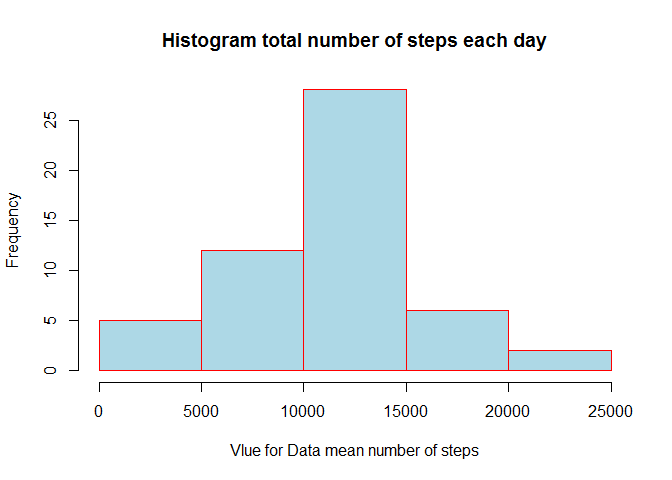
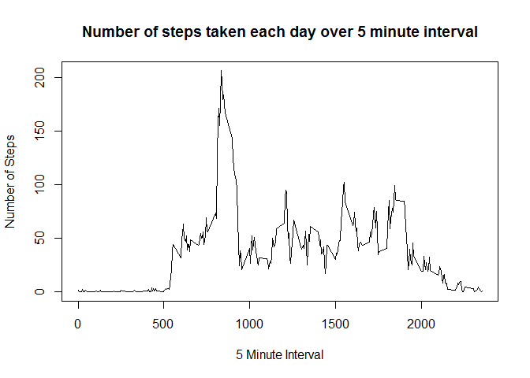
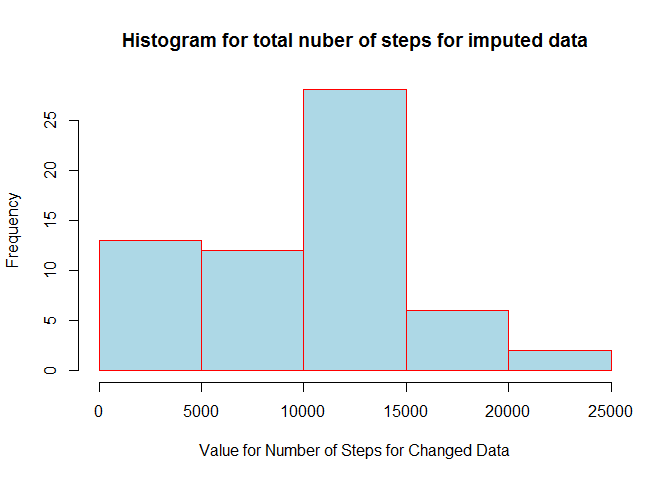
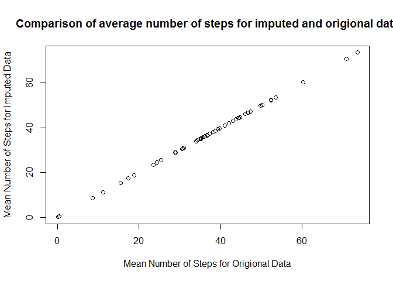
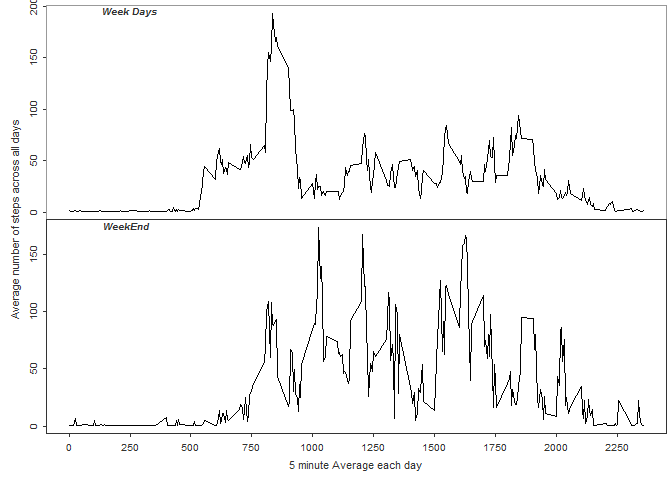

# Reprodceable Research Assignment 1
Faizan Ahmed  
Friday, April 17, 2015  
Loading and preprocessing the data
-----------------------------------------

First load the data, using the following command.


```r
data<-read.csv('D:/Coursera/ReproduceableResearch/repdata-data-activity/activity.csv')
```
For the moment I do not apply any preprocessing for the data.

What is mean total number of steps taken per day?
-------------------------------------------------
- Calculate the total numbe rof steps taken per day. For this I use the following R code.
I use the package plyr to calculate the numbe step taken per day. Note that this includes those days where no steps are taken.


```r
library(plyr)
sum_steps<-ddply(data, .(date), summarise, TotalSteps=sum(steps))
```
- Create histogram.
For creating hitogram I use the function `hist`. Note that the data has NA values so i use the option `na.rm=TRUE`. Here is R code to do that.


```r
hist(sum_steps$TotalSteps,col = "lightblue", border = "red",xlab="Vlue for Data mean number of steps",main='Histogram total number of steps each day')
```

 

- Calculate mean and median steps taken per day.
To calculate mean and median steps taken per day use the following:


```r
## Mean
```

```r
mean_steps<-ddply(data, .(date), summarise, meanSteps=(mean(steps,na.rm=TRUE)))
## Median
median_steps<-ddply(data, .(date), summarise, medianSteps=(median(steps,na.rm=TRUE)))
```

So the mean of total steps is 1.0766189\times 10^{4} while median is 10765.

What is the average daily activity pattern?
---------------------------------------------
- Make a time series plot (i.e. type = "l") of the 5-minute interval (x-axis) and the average number of steps taken, averaged across all days (y-axis)

First I calculate the mean steps for five minute interval.

```r
mean_steps_int<-ddply(data, .(interval), summarise, meanSteps=(mean(steps,na.rm=TRUE)))
```

Now plotting the reults:

```r
plot(mean_steps_int,type="l",xlab="5 Minute Interval", ylab="Number of Steps")
title("Number of steps taken each day over 5 minute interval")
```

 

- Which 5-minute interval, on average across all the days in the dataset, contains the maximum number of steps?

To do this one need to calculate the index corresponding to maximum value of the frame `mean_steps_int$meanSteps`. The following is the `R` code:

```r
mean_steps_int$interval[which.max(mean_steps_int$meanSteps)]
```

```
## [1] 835
```

So for the interval number 835 the average number of step is maximum.

Imputing missing values
-----------------------------

- Numer of missing values.

The function `is.na` return vectors with `TRUE` if the value is `NA`, `False` otherwise. Using the `sum` function we can count the number of missing values. The R code is the following.


```r
sum(is.na(data$steps))
```

```
## [1] 2304
```

So in total 2304 rows has missing values. 

- Filling missing values.

Here we replace the missing value with the mean of the whole day.`Ceiling` function is used to convert mean to integer value. First we create a new data set that is the same as the origional data set.


```r
Data2<-data
```
I use the mean step per day calculated before. Now replacing each `NA` with the mean of the day. If the value of the mean is also `NA` than it is replaced `1`.


```r
for (i in 1:nrow(mean_steps)){
  idx<-which(Data2$date==mean_steps$date[i] & is.na(Data2$steps)==TRUE)
  if (is.nan(mean_steps[i,2])){
    Data2$steps[idx]<-1
  }else{
    Data2$steps[idx]<-ceiling(mean_steps[i,2])
  }
}
# Check to see if there are any NA left in the data.
sum(is.na(Data2))
```

```
## [1] 0
```

- Create a dataset with missing data filled.
This part is already done. The name of new dataset is `Data2`.

- Make a histogram of the total number of steps taken each day and Calculate and report the mean and median total number of steps taken per day. Do these values differ from the estimates from the first part of the assignment? What is the impact of imputing missing data on the estimates of the total daily number of steps?

First I calculate the number of step for each day

```r
library(plyr)
sum_steps_Data2<-ddply(Data2, .(date), summarise, TotalSteps_Data2=sum(steps))
```


```r
hist(sum_steps_Data2$TotalSteps_Data2,col = "lightblue", border = "red",xlab="Value for Number of Steps for Changed Data",main='Histogram for total nuber of steps for imputed data')
```

 

To calculate mean and median steps taken per day use the following:


```r
## Mean
mean_Step_data2<-ddply(Data2, .(date), summarise, meanSteps=(mean(steps,na.rm=TRUE)))
## Median
median_Step_data2<-ddply(Data2, .(date), summarise, medianSteps=(median(steps,na.rm=TRUE)))
```

To see the difference of means, I create a plot where  on `x-axis` mean steps fro original data is given while `y-axis` contains mean for imputed data.


```r
plot(mean_steps$meanSteps,mean_Step_data2$meanSteps,xlab="Mean Number of Steps for Origional Data",ylab="Mean Number of Steps for Imputed Data")
title("Comparison of average number of steps for imputed and origional data")
```

 

From the graph it is apperant that the both mean values are same (approximately). The conclusion is there is no difference in two mean values. It can be checked for median in a similar way. In an average case no impact of imputant is observed. 

Are there differences in activity patterns between weekdays and weekends?
---------------------------------------------------------------------------
- Create a new factor variable in the dataset with two levels - "weekday" and "weekend" indicating whether a given date is a weekday or weekend day.

The R code for creating new factor in the data is given below:


```r
unique_Date<-unique(Data2$date)
for (i in 1:nrow(mean_steps)){
  idx<-which(Data2$date==unique_Date[i])
  day<-weekdays(as.Date(unique_Date[i]))
  if (day=="Sunday" || day=="Satureday"){
    Data2$dayType[idx]<-"WeekEnd"
  }else{
    Data2$dayType[idx]<-"WeekDAY"
  }  
}
```
- Make a panel plot containing a time series plot `(i.e. type = "l")` of the 5-minute interval (x-axis) and the average number of steps taken, averaged across all weekday days or weekend days (y-axis). See the README file in the GitHub repository to see an example of what this plot should look like using simulated data.

First calculate the mean steps for each interval. 

```r
mean_steps_int<-ddply(Data2, .(interval), summarise, meanSteps=(mean(steps,na.rm=TRUE)))
```

Now splitting data according to `WeekDAY` and `WeekEnd`.


```r
WkD<-Data2[which(Data2$dayType=="WeekDAY"),]
WkE<-Data2[which(Data2$dayType=="WeekEnd"),]
mean_steps_WkD<-ddply(WkD, .(interval), summarise, meanSteps=(mean(steps,na.rm=TRUE)))
mean_steps_WkE<-ddply(WkE, .(interval), summarise, meanSteps=(mean(steps,na.rm=TRUE)))
par(mfrow = c(2, 1))
par(cex = 0.6)
par(mar = c(0, 0, 0, 0), oma = c(4, 4, 0.5, 0.5))
par(tcl = -0.25)
par(mgp = c(3, 0.6, 0))
plot(mean_steps_WkD,type="l",axes=FALSE)
axis(2, col = "grey20", col.axis = "grey20", at = seq(0,200,50))
box(col = "grey60")
mtext("Week Days", side = 3, line = -1, adj = 0.1, cex = 0.6,col = "grey20",font = 4)
plot(mean_steps_WkE,type="l",axes=FALSE)
axis(1, col = "grey20", col.axis = "grey20", at = seq(0,2250,250))
axis(2, col = "grey20", col.axis = "grey20", at = seq(0,200,50))
box(col = "grey20")
mtext("WeekEnd", side = 3, line = -1, adj = 0.1, cex = 0.6,col = "grey20",,font = 4)
mtext("5 minute Average each day", side = 1, outer = TRUE, cex = 0.7, line = 2.2,col = "grey20")
mtext("Average number of steps across all days", side = 2, outer = TRUE, cex = 0.7, line = 2.2,col = "grey20")
```

 


